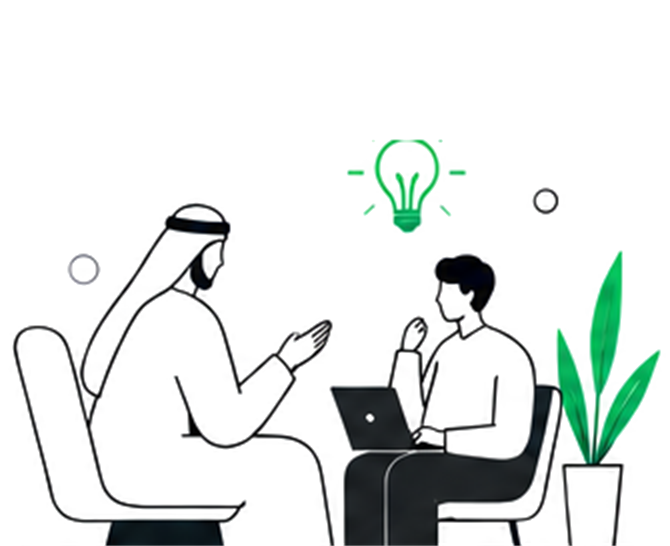

# Start SAH — visual identity

This is the visual system the prototype in `index.html` is built from. It exists
so the WordPress build reproduces the same look without guessing, and so Sonia
can check the direction against the brief before any of it is rebuilt.

Everything here follows the 16 September direction: **large, clean, sophisticated,
faceless illustrations; the bright logo green; charcoal instead of dark green;
plenty of white space.**

---

## Colour

Four colours. Nothing else.

| Role | Hex | Where it goes |
| --- | --- | --- |
| START Green | `#00C853` | One accent at a time — a button, a shape in an illustration, a rule under a heading. Never a page background. |
| Charcoal | `#2E2E2E` | All text and line work. Also the dark section bands. |
| Off-White | `#FAFAFA` | Quiet section backgrounds, alternating with white. |
| Light Grey | `#E6E6E6` | Hairline rules, secondary fills inside illustrations. |

Supporting steps (tints of the same four) are declared once in the Tailwind
config at the top of `index.html`. Two deliberate decisions there:

- **`emerald-500` and `emerald-600` are both `#00C853`.** Whichever step a button
  already used, it lands on the exact logo green.
- **`emerald-700` and above are darker** (`#00963C`, `#007A31`, `#006027`) and are
  only for green *text*, which needs the contrast against white.

The dark greens from the earlier mock-up (`#0D2217`, `#16A34A`, `#15803D`,
`#059669`) are gone. Dark bands are charcoal.

> The logo files in `assets/` and `public/` are a traced placeholder that still
> carried the old greens; they have been recoloured to match. **Replace them with
> the real vector logo before launch.**

## Type

Plus Jakarta Sans throughout.

| Use | Size | Weight |
| --- | --- | --- |
| Page heading | 36–60px, tight tracking | 800 |
| Section heading | 30–40px | 800 |
| Sub-heading | 18–20px | 700 |
| Body | 14–18px, relaxed leading | 400 |
| Eyebrow label | 12px, uppercase, wide tracking | 700, green |

Headings are sentence case, not title case. A short green rule (`.rule-green`,
56 × 3px) sits under a section heading in place of a boxed badge.

## Section rhythm

Pages alternate bands so a long page never reads as one flat stretch:

```
white  →  off-white  →  white  →  charcoal  →  off-white  →  white
```

- `.band-off` — off-white section
- `.band-ink` — charcoal section, white text
- `.on-ink` — put on any charcoal container so the illustrations inside flip to
  white line work automatically
- `.hairline` — `#E6E6E6` border, used instead of heavy card borders

Content sits directly on the band. Cards are used only where something really is
a discrete object — a programme in a catalogue, a stat, a form. Narrative
sections are open, which is what "more flow between sections rather than
everything sitting inside separate boxes" asked for.

---

## Illustration library

**`assets/illustrations/`** — thirty illustrations cut from the two approved
reference sheets. These are the artwork; the site does not draw its own.

They come in two sets:

- **`topic-*`** — the ten from the sheet that names an illustration per subject
  (Human Development, Career & Employability, Communication & Professional
  English, and so on). Each of these goes to its own section, which is what "a
  different visual story for each topic" asks for.
- **`01-`…`20-`** — the twenty unnamed ones, for everything else: programme
  cards, supporting sections, dashboard tiles.

Across 32 places on the site, 30 different illustrations are used. The only two
that appear twice do so on different pages.

Both sheets were cut on measured panel boundaries rather than an even grid — the
rows are not evenly spaced, and an even split clipped the bottom of every scene.
On the titled sheet the text sits over the artwork (the signpost in "Career &
Employability" is level with its own subtitle), so a horizontal cut cannot
separate them; the text blocks are painted out first, then whole cells are
cropped. Every file is keyed so the sheet's white background is transparent,
which is why each one drops onto white or off-white without showing a box.

### What the style is

Worth stating so anything added later matches:

- Flat line art. No gradients, no glows, no drop shadows.
- Thin charcoal outlines; solid charcoal for hair, abaya, trousers and laptops.
- **Faceless.** A profile line, never eyes or a mouth.
- **One green accent** per illustration — a laptop screen, an arrow, a bulb, a
  puzzle piece. Green is never the whole scene.
- Saudi and GCC dress (thobe with ghutra and agal, abaya) alongside
  international business dress, men and women, at different career stages.
- One idea per illustration, with room around it.

### The ten topic illustrations

Each of these belongs to one subject and is used only there.

| File | Section it serves |
| --- | --- |
| `topic-human-development` | Homepage hero — Developing People. Unlocking Potential. |
| `topic-career-employability` | Career & Employability |
| `topic-communication-english` | Communication & Professional English |
| `topic-personal-development` | Personal Development & Executive Presence |
| `topic-leadership-workplace` | Leadership & Workplace Skills |
| `topic-training-development` | Training & Development |
| `topic-coaching-mentoring-topic` | Coaching & Mentoring |
| `topic-organisational-development` | Organisational Development |
| `topic-teamwork-culture` | Teamwork & Organisational Culture |
| `topic-train-the-trainer` | Train the Trainer |

### The twenty supporting illustrations

| File | What it shows |
| --- | --- |
| `01-growth-momentum` | Working on a laptop on rising steps, a green arrow sweeping up behind |
| `02-career-pathways` | Pausing at a signpost, weighing which direction to take |
| `03-communication` | Two colleagues across a table, one speech bubble answering another |
| `04-training-delivery` | A trainer in thobe and ghutra presenting results to a seated group |
| `05-new-ideas` | Reaching up towards a lit idea from a laptop |
| `06-teamwork` | Three colleagues working together around one laptop |
| `07-coaching-mentoring` | A mentor in thobe and ghutra guiding a colleague at her laptop |
| `08-learning` | Working on a stack of books beneath a graduation cap |
| `09-problem-solving` | Considering two puzzle pieces not yet joined |
| `10-career-progression` | Stepping up onto rising blocks, briefcase in hand |
| `11-time-focus` | Working to time at a laptop beside a clock |
| `12-goals-outcomes` | Ticking off a checklist beside a target struck in the centre |
| `13-network-community` | At a laptop, connected out to a network of colleagues |
| `14-idea-leadership` | Holding up a lit idea |
| `15-balance-wellbeing` | Working calmly and in balance |
| `16-partnership` | Two colleagues in abaya shaking hands over an agreement |
| `17-insights-analysis` | Talking a seated group through charts |
| `18-next-step` | Stepping onto the next block, towards the one after it |
| `19-global-english` | Sending work out into the wider world |
| `20-vision-direction` | Sighting the route to a flag on the summit |

### Placing one

```html
<div class="ill-stage">
  
</div>
```

- `.ill-lg` / `.ill-xl` / `.ill-md` cap the width (500 / 620 / 380px).
  Illustrations are meant to be **large** — a desktop hero, not a thumbnail.
- Never give one a fixed height. `.ill` sets `object-fit: contain` so a tight
  slot letterboxes rather than squashing the artwork, but a natural height is
  better.
- Always write a real `alt`. The artwork carries meaning; it is not decorative.

### On a charcoal band

The line work is charcoal, so it disappears on a dark background. Any container
that is dark — `.on-ink`, `.band-ink`, or a charcoal `bg-[…]` class — puts the
illustration on an off-white rounded panel automatically. Do not place artwork
directly on charcoal.

### Two things to settle before launch

1. **Resolution.** Both sheets are 1536 × 1024, so each illustration is roughly
   290 × 230 before upscaling. That reads cleanly on a standard screen and looks
   soft on a retina one at hero size. Ask for each illustration to be re-exported
   on its own at 1024px or larger; the files here can then be swapped one for one
   without touching any markup.
2. **Weight.** 30 transparent PNGs come to about 5 MB. They are lazy-loaded, so
   no page pays for all of them, but the WordPress build should convert them to
   WebP and serve responsive sizes.

---

## What is deliberately absent

These were in the earlier mock-up and were removed against the September
feedback, so they should not come back in the WordPress build:

- Dark-green section bands.
- Framed gradient panels around illustrations, and dashed decorative frames.
- Overlapping floating badges stacked on top of hero visuals.
- Rows of small illustrations — one large illustration does more work than four
  small ones. An illustration squeezed into a banner strip is clutter; use an
  icon there instead.
- Portrait photography. Where photography is used later, prefer meetings,
  training and workspaces where faces are not the focus.
